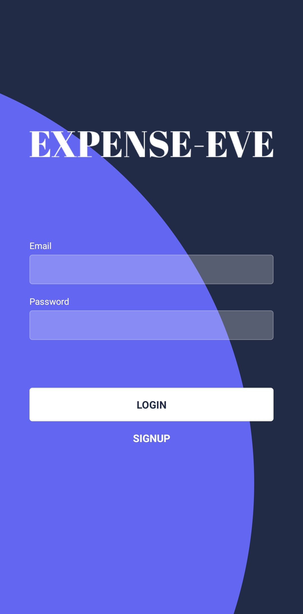
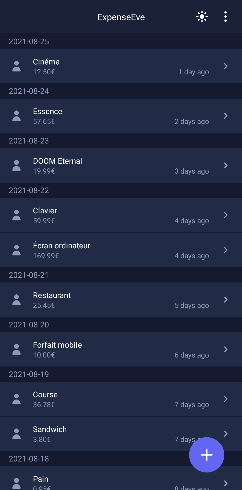
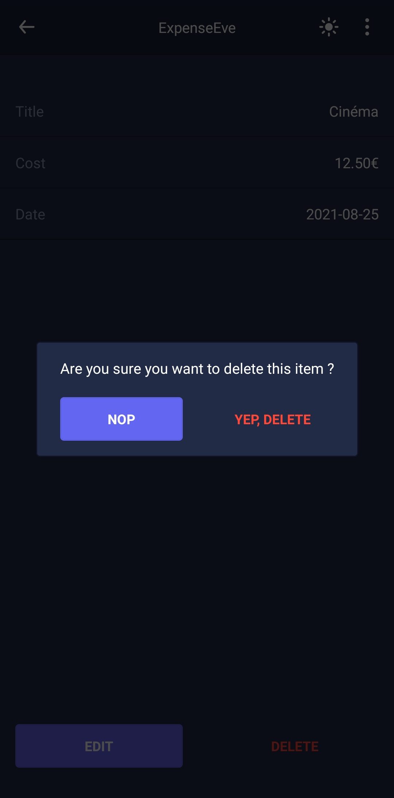

<div align="center">

**_Application_**

</div>

## About ExpenseEve

Application allowing to record all the expenses of a person.

## Related

Here are some related projects

[API](https://github.com/KristenJestin/expense-eve-api)

## Tech Stack

**Client:** React-Native, UI Kitten

**Server:** AdonisJS

## Features

-   Store all expenses
-   Have access to all recent expenses
-   Light/dark mode toggle

## Screenshots

| Login Page                             | Home Page                            | Show page with deletion                            |
| -------------------------------------- | ------------------------------------ | -------------------------------------------------- |
|  |  |  |

## Run Locally

Install the [API part](https://github.com/KristenJestin/expense-eve-api#run-locally)

Clone the project

```bash
  git clone https://github.com/KristenJestin/expense-eve-app
```

Go to the project directory

```bash
  cd expense-eve-app
```

Install dependencies

```bash
  yarn install
```

Create env file

```dosini
# .env
BASE_URL=http://localhost:3333
PERSIST_KEY=my-secret-key
```

Start the server

```bash
  yarn run start
```

Start on the device

```bash
  yarn run android
  # or
  yarn run ios
```

## Roadmap

-   Add the possibility to create "recurring" expenses. _Example: Define that on the 25th of each month, I will have a 10€ expense for my mobile plan_.

-   Add the possibility to define categories

-   Add the possibility to define tags

-   Add a summary of all the expenses of the day, week, month, year, etc

-   Add the possibility to define a list of items when creating an expense

## License

Distributed under the MIT License. See [`LICENSE`](https://github.com/KristenJestin/expense-eve-app/blob/master/LICENSE) for more information.

<hr>

<div align="center">

[@KristenJestin](https://www.github.com/KristenJestin)

</div>

<div align="center">

[](https://kristenjestin.fr)
[](https://www.linkedin.com/in/kristen-jestin)

</div>
